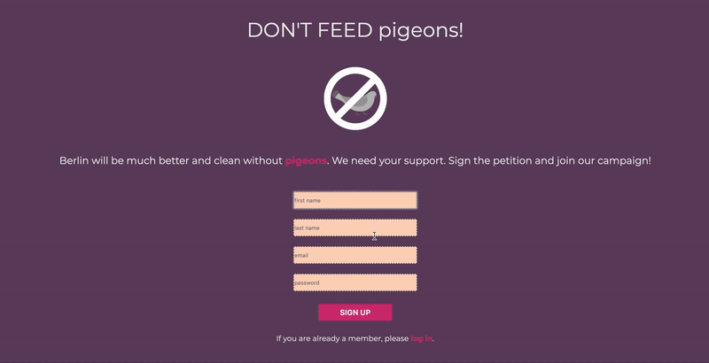
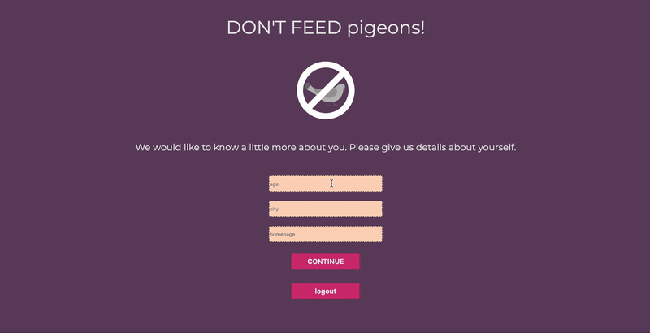
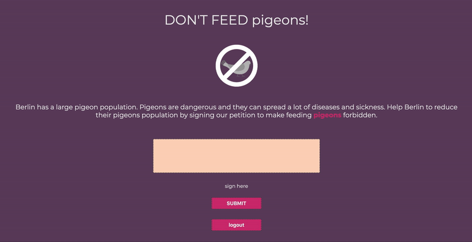
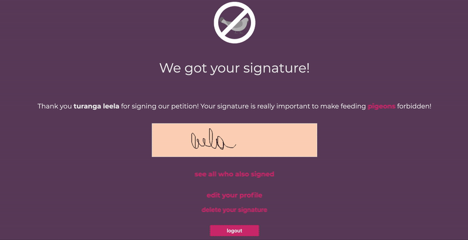

# about

The idea behind the petition theme came an information about an increasement in the number of pigeons in large cities. Pigeons are dangerous animals and they can emit many diseases to humans. A study has shown that when pigeons are not fed, and they have to hunt their own food, their population will decrease since they will not have time to breed in mass. The petition aims to collect signatures from people who agree that feeding pigeons should be banned to help reduce the big pigeon population.

# features

## home, login, register

Users are welcomed to the landing page where they find information about the petition and cause. They can provide their details for registration or navigate to the login page.



## add profile

Users can give more profile details as age, city and homepage.



## sign

Users can sign the petition.



## see other signees and edit profile

Users can see a list of other supports who signed sorted by location. They can redo their signature and update profile information.



# technologies

- jQuery
- Handlebars
- Node.js
- Express.js
- PostgreSQL

# instructions

1.  clone repository

    ```bash
    git clone https://github.com/ingriddorioschulze/petition
    cd petition
    ```

2.  install dependencies

    ```bash
    npm install
    ```

3.  setup database

    you need PostgreSQL at least version 9 and your system user needs to be able to access the server without a password.

    ```bash
    createdb petition
    cd sql
    psql -d petition -f users.sql
    psql -d petition -f user_profiles.sql
    psql -d petition -f signatures.sql
    ```

4.  start the application

    ```bash
    npm start
    ```

    now go to http://localhost:8080 in your browser

# coming soon features

- delete profile
- touchscreen signature
- responsive design

# credits

Images:

- Google Images
